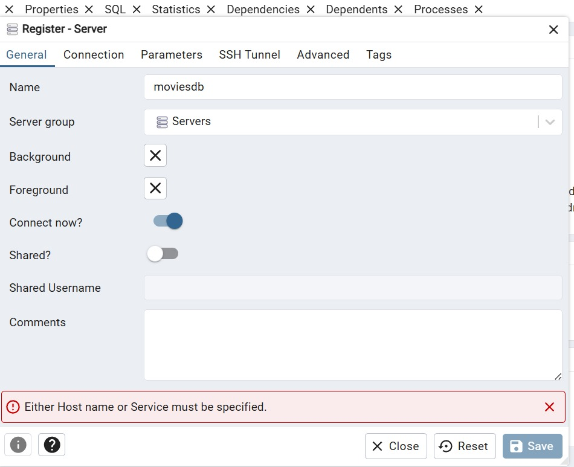
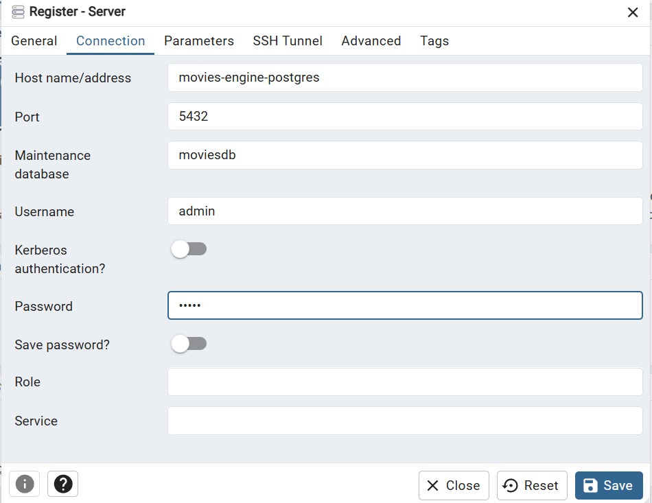

## Description

Movie Engine is an app that allows users to lookup, search and rate movies.
The backend is built with NestJS and Pisma as and ORM, PostgreSQL as a DB and OpenSearch for searching capabilities.

## Project setup

If you want to start the app you need to have the latest NodeJS LTS and Docker installed.

Once installed, pull the project and run 

```bash
npm install

or 

yarn install
```
and 

```bash
docker-compose up -d
```

which will pull the requirements such as db and opensearch.

For the purpuses of testing this app .env file will be provided in this repository

After that run the two following commands:

```bash
npx prisma generate
```


```bash
npx prisma migrate
```


 - for generating the db schema
 - the following images show how to connect to pgadmin if db is not visible

 - firstly right click on servers to register a new server like in the shown images






- in the tools tab select Query tool to run the .sql scripts provided in prisma folder of the project


## Compile and run the project

bash
$ npm run start:dev


## Endpoints

- OpenAPI specification is provided on localhost:8080//api

- Every API is protected via an API token provided in env (sent as X-API-Key header)

## IMPORTANT NOTICE
 Syncing with OpenSearch service currenly is done manually by making a POST request to the following api endpoing:

bash
POST {{baseUrl}}/movies/sync/start

## DISCLAIMER
- Calculating avg ratings and syncing PostgreSQL and Opensearch are done via Redis Streams.
- .env folders are pushed simply for the reason of easier dev setup